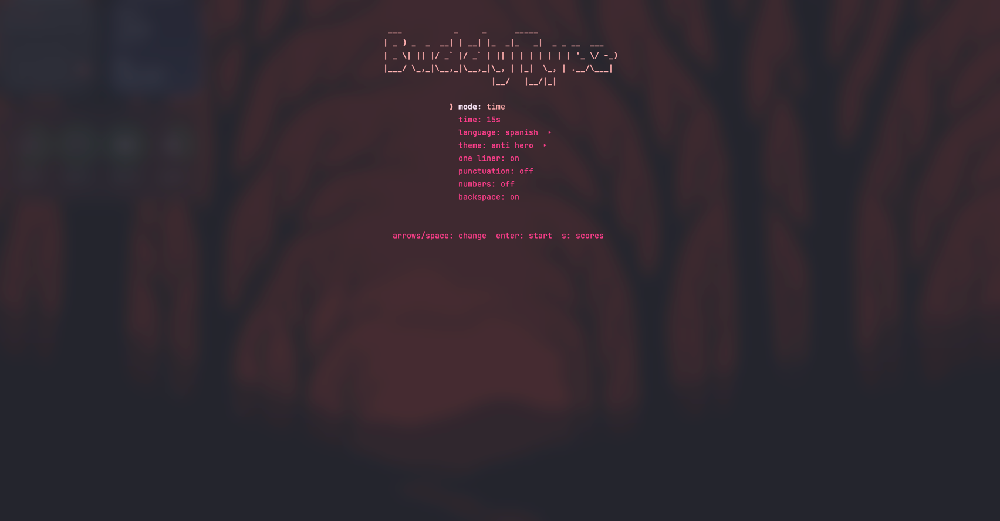

# BuddyType

A [MonkeyType](https://monkeytype.com) clone that runs entirely in your terminal.

<p align="center">
  
</p>

## Install

```bash
curl -fsSL https://raw.githubusercontent.com/DanielD2G/BuddyTypeCLI/main/install.sh | bash
```

Detects your OS and architecture automatically. Installs to `/usr/local/bin`.

### Build from source

Requires **Rust 1.80+** (uses `LazyLock` from std).

```bash
git clone https://github.com/DanielD2G/BuddyTypeCLI.git
cd BuddyTypeCLI
cargo build --release
./target/release/buddytype
```

## Features

- **Two modes** - Time-based (15 / 30 / 60 / 120 seconds) or word count (10 / 25 / 50 / 100 words)
- **11 languages** - English, Spanish, French, German, Italian, Portuguese, and code syntax for JavaScript, TypeScript, Python, Rust, Go
- **190+ themes** - Built-in dark & light plus the full MonkeyType community theme collection
- **Live metrics** - WPM, raw WPM, accuracy, and timer update on every keystroke
- **Consistency score** - Uses MonkeyType's kogasa function to measure typing steadiness
- **Score history** - Persists your last 100 results locally for review
- **Punctuation & numbers** - Toggle extra difficulty on any language
- **Full backspace support** - Delete characters, clear words with Ctrl+Backspace, or go back to previous words
- **Multi-line & tape mode** - Choose between 3-line word display or MonkeyType-style tape scrolling

## Controls

### During a test

| Key | Action |
| --- | --- |
| *any character* | Start typing (test begins on first key) |
| `Space` | Submit current word, advance to next |
| `Backspace` | Delete last character or return to previous word |
| `Ctrl+Backspace` | Clear entire current word |
| `Tab` | Restart the test |
| `Esc` | Return to menu |
| `Ctrl+C` | Quit |

### Menu

| Key | Action |
| --- | --- |
| `Up` / `k` | Move up |
| `Down` / `j` | Move down |
| `Left` / `Right` / `Space` | Cycle option values |
| `Enter` | Start test (or open picker for language/theme) |
| `s` | View score history |

## How WPM is calculated

All formulas match [MonkeyType](https://monkeytype.com):

| Metric | Formula |
| --- | --- |
| **WPM** (net) | `(correctWordChars / 5) / minutes` — only fully correct words count |
| **Raw WPM** | `(allTypedChars / 5) / minutes` |
| **Accuracy** | `correctKeypresses / totalKeypresses * 100` |
| **Consistency** | Kogasa function: `100 * (1 - tanh(cov + cov^3/3 + cov^5/5))` where `cov` is the coefficient of variation of per-second WPM samples |

## Architecture

```
src/
├── engine/         Pure Rust — zero UI dependencies
│   ├── timer.rs            Timer state machine
│   ├── word_generator.rs   Power-law word sampling + punctuation/numbers
│   ├── input_processor.rs  Keystroke handling & character tracking
│   └── stats_calculator.rs WPM, accuracy, consistency calculations
├── ui/             Reusable TUI widgets (ratatui)
├── screens/        Full-screen views (menu, test, results, scores)
├── data/           Language & theme loaders (compile-time embedded)
├── config/         Local persistence (settings + scores)
├── types.rs        All shared structs/enums
├── app.rs          App state machine
└── main.rs         Entry point (terminal setup, event loop)

data/
├── languages/      Word lists (MonkeyType-compatible JSON)
└── themes/         Theme definitions (JSON)
```

The engine layer is **completely decoupled from the UI** — every function is pure, takes ownership and returns modified state, and tested with `cargo test`.

## Development

```bash
cargo run              # Run in debug mode
cargo build --release  # Optimized build
cargo test             # Run all tests (98 tests)
cargo clippy           # Lint
```

## Tech stack

| Layer | Technology |
| --- | --- |
| Language | Rust (edition 2024) |
| Terminal UI | ratatui + crossterm |
| Data | serde + serde_json (compile-time embedded) |
| Config | directories crate (OS-native config path) |
| RNG | rand (power-law word selection) |
| Tests | cargo test (built-in) |

## Acknowledgments

Word lists and theme definitions are sourced from [MonkeyType](https://github.com/monkeytypegame/monkeytype), licensed under GPL-3.0.

## License

This project is licensed under the [GNU General Public License v3.0](LICENSE) — the same license as MonkeyType, whose word lists and themes are included in this project.
